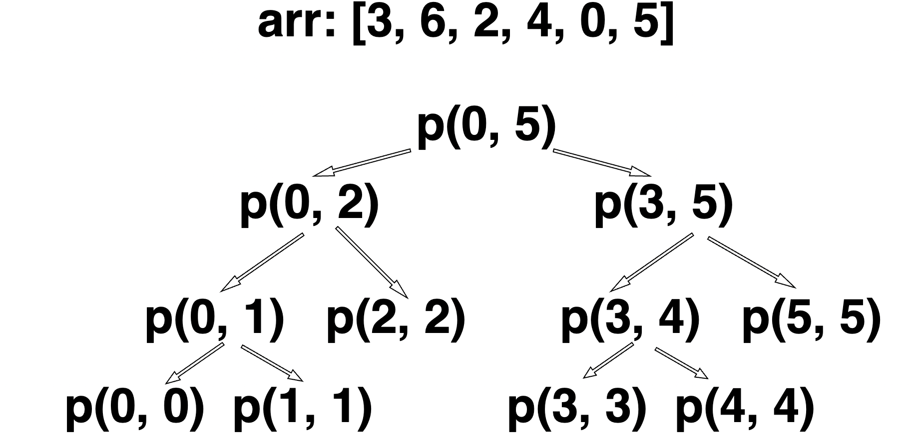

目录：

- [递归](#递归)
	- [扩展 -- 右移 \& 左移](#扩展----右移--左移)
- [归并排序](#归并排序)
	- [扩展](#扩展)


# 递归
demo: 给定数组找最大值

递归实现：对数组二分，获取二分后两边最大值，再比较最终的最大值；某一边求最大值也是使用二分求两侧最大值......

[-> 代码实现](./recursion.js)


时间复杂度：

master公式：

满足 $T(N) = a*T(\frac{N}{b}) + O(N^d)$ 时

1) $log_ba > d => O(N^{log_ba})$

2) $log_ba < d => O(N^d)$

3) $log_ba = d => O(N^d*logN)$

补充阅读：[https://www.gocalf.com/blog/algorithm-complexity-and-master-theorem.html](https://www.gocalf.com/blog/algorithm-complexity-and-master-theorem.html)

对于上面的demo，

```js
// l～r长度为二分结果, 所以b = 2
function process (arr, l, r) {
	if (l === r) return arr[l] // 常数操作
	let mid = l + ((r - l) >> 1) // 常数操作
	let leftMax = process(arr, l, mid) // 子问题调用递归1次
	let rightMax = process(arr, mid + 1, r) // 子问题再调用递归1次，所以a = 2
	return process(leftMax, rightMax) // 常数操作，总的常数操作和N无关，只调用了有限次，d=0
}
```

$T(N) = 2 * T(\frac{N}{2}) + O(1)$

时间复杂度：$log_22 > 0 => O(N^{log_22}) = O(N)$

master公示适用范围：一系列子问题组合，且子问题都是等规模的（每次递归，a = 有多少个子问题，b = 子问题的规模，例如上面，每次需要调用两次递归求出左右两个最大值，也就是两个子问题，a = 2， 每次递归都是二分结果，数据规模是N/2，即b = 2，每次递归里的常数操作和N无关，为O(1)）


## 扩展 -- 右移 & 左移
**[左移操作符 (`<<`)](https://developer.mozilla.org/zh-CN/docs/Web/JavaScript/Reference/Operators/Left_shift)**
 将第一个操作数向左移动指定位数，左边超出的位数将会被清除，右边将会补零

**[右移操作符 (`>>`)](https://developer.mozilla.org/zh-CN/docs/Web/JavaScript/Reference/Operators/Right_shift)**
 是将一个操作数按指定移动的位数向右移动，右边移出位被丢弃，左边移出的空位补符号位（最左边那位）

可以参考十进制：

```javascript
对于十进制：2304 --左移1位,右边补0--> 23040
```

可以这样理解：
数值左移一位 ↔ 小数点右移一位，也就是原来每一位$*10$

```javascript
2304 = 2000 + 300 + 0 + 4$

左移（整体前进一位 = 每一位*10）：

23040 = 2000*10^1 + 300 *10^1 + 0 * 10^1 + 4 * 10^1 = 2304 * 10^1
```

即，左移$n$位，数据$*10^n$，右移$n$位，数据$/10^n$**

对于二进制，**左移$n$位，数据$*2^n$**

```javascript
0110 --左移2位，右边补0--> 1100 （3 -> 12 = 3 * 2^2）
```

右移$n$位，数据$/2^n$

```javascript
0000 1001 -- 右移2位，左边用符号位补，右边移出位被丢弃 -> 0000 0010 (9 -> 2，即 9>>2 = 2)

1111 0111 -- 右移2位，左边用符号位补，右边移出位被丢弃 -> 1111 1101 (-9 -> -3, 即 -9>>2 = -3)
```

注意：对于左移，需要考虑**溢出**问题

例如，对于1个字节，只有8位
```javascript
255: 1111 1111 --左移1位--> 1 1111 1110 --溢出1位，去掉--> 1111 1110 = 254
```

# 归并排序
左右分别排序，再移动两侧指针，整合到辅助数组中

例：给定一个数组，按从小到大排序

方法：
1. 数组二分，左、右两边边排好序，最后合并：
2. 左右两个数组分别定义一个指针指向在各自第一个
3. 准备另一个空数组，比较两侧指针指向的元素，哪个小就放进数组中，对应指针向右移动
4. 如果某侧数组指针溢出（数组到头了），则将剩下的数组放到准备的数组里


[-> 代码实现](./mergeSort.js)

符合master公式：

子问题二分，b = 2，左右各递归一次，a = 2，剩余排序的事件复杂度O(N)（两侧指针分别移动，O(N)，最后再整合到数组中，O(N)）


时间复杂度：

$T(N) = 2 * T(\frac{N}{2}) + O(N)$

$log_22 === 1 => O(N^1*logN) = O(NlogN)$

对于$O(N^2)$排序算法：浪费了大量的比较过程，求$i$位置应该放什么数，需要比较大概$i - 1$次，每一轮排序都要做大量的比较，而且每一轮比较相对于下一轮比较都是独立的。

对于归并排序：每次比较L~R范围内的数，通过移动两次指针，最后让数组上L~R范围成为一个有序的整体，然后下次再和另一部分比较，最后合并为更大一部分有序的整体，所以没有浪费比较的行为。


## 扩展

1. 小和问题
	给定数组，对于每一项元素x，求出x左侧比它小的元素之和，最后相加

	- 方法一：暴力求解
	```js
	let arr = [1, 3, 2, 4, 5]
	let sum = 0
	for (let i = 1; i < arr.length; i++) {
	for (let j = 0; j < i; j++) {
		if (arr[j] < arr[i]) {
			sum += arr[j]
		}
	}
	}
	console.log(sum)
	// 1左侧没有比它小的数
	// 3左侧小的数：1
	// 2左侧小的数：1
	// 4左侧小的数：1、3、2，加起来6
	// 5左侧小的数：1、3、2、4，加起来10
	// 1 + 1 + 6 + 10 = 18
	```
	时间复杂度$O(N^2)$


	- 方法二：归并排序 + 逆向思维

		求每一项左侧比它小的数之和 => 求每一项右侧比它大的数有几个，则这个数需要加几次

		使用归并排序：左侧求小和且排序，右侧求小和且排序，左右合并求小和且排序。

		[-〉 代码实现](./smallSort.js)


2. 逆序问题